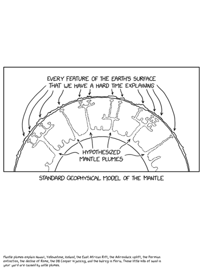
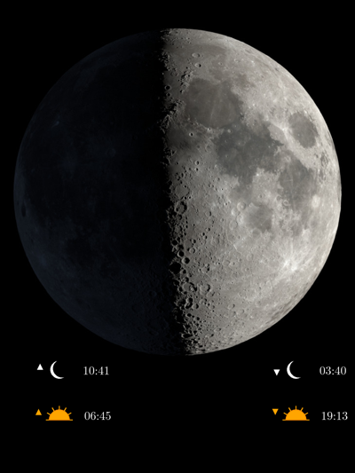
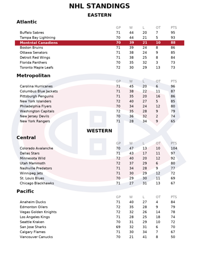
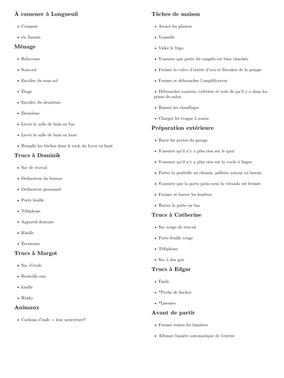
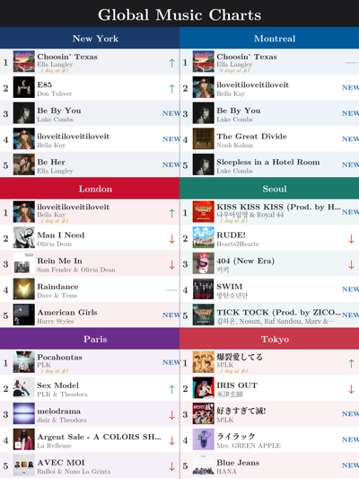
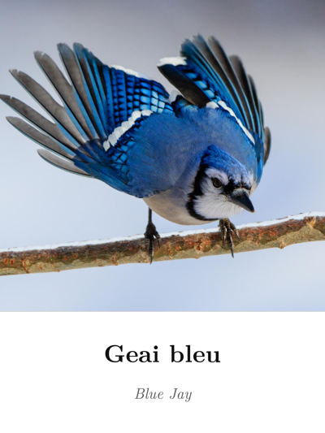
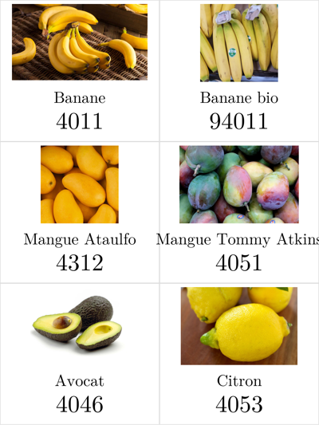
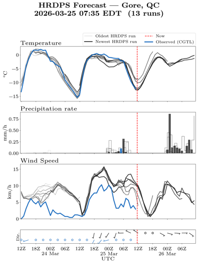
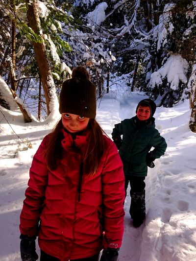

# E-ink Display Scheduler

A Python scheduler for a [Waveshare 13.3-inch 7-color e-ink display](https://www.waveshare.com/13.3inch-e-paper-hat-e.htm) (1200×1600 px) running on a Raspberry Pi. It cycles through generated images on a configurable weekly schedule, and picks random images outside scheduled periods.

## Hardware

- **Display:** Waveshare 13.3" 7-color e-ink (black, white, yellow, red, orange, blue, green)
- **Host:** Raspberry Pi (service runs as `eink-scheduler.service`)
- **Resolution:** 1200×1600 px (portrait, 3:4 ratio)

## How It Works

1. `scheduler.py` reads `schedule.conf` and checks every 30 s which schedule is active.
2. **Scheduled period:** runs the mapped display function once on entry.
3. **Outside schedule:** picks a random function from `DISPLAY_FUNCTIONS_TO_RUN_RANDOMLY` every 10 minutes.
4. Each display function returns a file path string, or `"shutdown"` to clear the screen, or `None` on failure.

## Image Generators

### XKCD Comic

Fetches and renders an [XKCD](https://xkcd.com) comic in the XKCD hand-drawn font. Either today's comic or a random one, with the alt-text caption below. Comics and font courtesy of [Randall Munroe](https://xkcd.com/about/) — thanks!



---

### Moon Phase

Fetches NASA's Dial-A-Moon image for tonight's moon, and overlays Montreal-area sunrise, sunset, moonrise, and moonset times computed via `ephem`.



---

### NHL Standings

Current NHL standings fetched from the NHL API. The Montréal Canadiens row is highlighted in red.



---

### Chalet Closing Checklist

Fetches a Markdown to-do list from Dropbox (`/listes/fermeture_du_chalet.txt`) and renders it as a styled checklist — used as a weekly departure checklist when leaving the chalet.



---

### Music Charts

Top 5 songs in 6 cities (New York, London, Paris, Montréal, Tokyo, São Paulo) fetched from the Apple Music RSS feed. Shows the chart history for each track across recent days.



---

### Quebec Feeder Birds

Flash-card style display for learning Quebec feeder bird names in French. Supports three card layouts: single-species full photo, male/female dimorphic comparison, and similar-species comparison (e.g. Pic chevelu vs Pic mineur). Photos live in `oiseaux/`.



---

### Grocery Produce Codes

Learning aid for grocery store PLU codes — shows fruit and vegetable photos with French names and 4-digit PLU codes. Images live in `fruits_et_legumes/`, codes in `produce_list.txt`.



---

### HRDPS Weather Forecast

Spaghetti plot of High Resolution Deterministic Prediction System (HRDPS) forecast runs. Shows temperature, precipitation, and wind speed over a 60-hour window (48 h past → 12 h ahead), with observed data in blue and each model run as a progressively darker gray line.



---

### Random Image from Dropbox

Picks a random photo from a synced Dropbox folder (`/random_images`), scales it to fill 1200×1600 with borders matched to the image's average edge color.



---

## Schedule Configuration

`schedule.conf` format: `days hour_start hour_end function_name`

```
# days: 0=Mon … 6=Sun; ranges (0-4), lists (0,2,4), wildcard (*)
# hours: 0-23; hour_start > hour_end spans midnight

# Shut down display on Friday (sleep in)
4  0 14 shutdown_display

# Show chalet closing checklist Sunday afternoon
6 14 23 todo_fermeture_chalet

# Turn off display Friday–Sunday nights
5-6 23 7 shutdown_display
```

Overlapping schedules are detected and cause a startup error.

To validate `schedule.conf` without restarting the service:

```bash
python3 config_file_handler.py
```

## Adding a New Display Function

1. Create a function that returns a file path string (or `None` on failure, `"shutdown"` to clear).
2. Add it to `FUNCTION_MAP` in `scheduler.py`.
3. Optionally add it (multiple times for higher probability) to `DISPLAY_FUNCTIONS_TO_RUN_RANDOMLY`.
4. Reference it by name in `schedule.conf` if you want it on a fixed schedule.

## Installation on Raspberry Pi

```bash
# Clone to Pi
git clone <repo> /home/pilist/eink_scheduler
cd /home/pilist/eink_scheduler

# Install dependencies
pip3 install -r requirements.txt

# Install and enable systemd service
sudo cp eink-scheduler.service /etc/systemd/system/
sudo systemctl daemon-reload
sudo systemctl enable --now eink-scheduler.service

# Check logs
sudo journalctl -u eink-scheduler.service -f
```

### HRDPS Data Fetching (Crontab)

`hrdps_fetch.py` requires `eccodes` and `cfgrib`, which are easiest to install via `miniforge`/`mamba`:

```bash
mamba create -n eink_display_env python=3.11 eccodes cfgrib numpy requests -c conda-forge
```

Schedule it to run ~1.5h after each HRDPS model run (00Z, 06Z, 12Z, 18Z UTC):

```bash
crontab -e
```

Add:

```
24 1,7,13,19 * * * cd /home/pilist/eink_scheduler && /home/pilist/miniforge3/envs/eink_display_env/bin/python3 hrdps_fetch.py >> hrdps_data/fetch.log 2>&1
```

The Waveshare EPD library (`epd13in3E`) must be installed separately. Set the `EPD_LIB` path at the top of `eink_driver.py` to point to the `lib/` directory of your local [e-Paper](https://github.com/waveshare/e-Paper) checkout.

## Testing Without Hardware

Set `test_mode=True` in `scheduler.py` — `eink_update()` will copy the image to `figures/current_image.png` instead of driving the display.

Each generator can also be run standalone:

```bash
python3 xkcd_image.py
python3 moon_phase.py
python3 nhl_classification.py
python3 music_charts.py
python3 generate_bird_names.py
python3 generate_produce_codes.py
python3 hrdps_image.py
python3 todo_image.py
```

## Image Processing Tools

```bash
# Crop photos to 3:4 ratio (interactive GUI):
python3 cropper.py /path/to/photos   # first run: scan directory
python3 cropper.py                    # subsequent runs: crop one by one

# Boost contrast/saturation for e-ink rendering:
python3 process_for_eink.py
```

## Dropbox Credentials

Store in `~/.config/Dropbox/.env` (not in repo):

```
DROPBOX_APP_KEY=...
DROPBOX_APP_SECRET=...
DROPBOX_REFRESH_TOKEN=...
```

## Running Tests

```bash
python3 -m pytest tests/
```

`tests/test_schedule_parser.py` covers the schedule logic thoroughly:

- **`Schedule.is_active()`** — single-day, multi-day, weekday ranges, weekend-only, and midnight-spanning schedules
- **`parse_days()`** — single days, ranges (`0-4`), lists (`0,2,4`), mixed formats, wildcard (`*`), and invalid inputs
- **Overlap detection** — catches conflicting schedules including midnight-spanning edge cases
